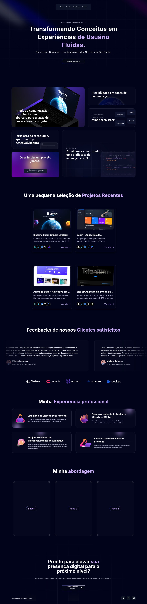

# 📌 Benjamin Portfólio - Next.js + TypeScript



🚀 Este é o meu projeto de **Portfólio** desenvolvido com **Next.js**, **TypeScript**, **Tailwind CSS** e outras bibliotecas modernas. Nele, pude aplicar na prática os conhecimentos adquiridos em desenvolvimento web, criando uma aplicação rápida, responsiva e otimizada.

## 🛠️ Tecnologias Utilizadas

- **Next.js**: Framework React para produção com renderização híbrida (SSG e SSR).  
- **TypeScript**: Tipagem estática para maior segurança e manutenção do código.  
- **Tailwind CSS**: Estilização moderna e responsiva com utilitários.  
- **Docker**: Contêiner para facilitar a implantação e desenvolvimento.  
- **Outras Bibliotecas**: React Icons, Framer Motion (animações) e muito mais!  

## 📄 Funcionalidades

✅ Apresentação dos meus principais projetos.  
✅ Seção "Sobre mim" com minha trajetória no desenvolvimento.  
✅ Layout responsivo para diferentes dispositivos.  
✅ Animações suaves e experiência do usuário otimizada.  

## 🚀 Como Executar o Projeto

### 1. Clone o repositório
```bash
  git clone https://github.com/seu-usuario/portfolio-nextjs.git
  cd portfolio-nextjs
```

### 2. Instale as dependências
```bash
  npm install
  # ou
  yarn install
```

### 3. Execute o ambiente de desenvolvimento
```bash
  npm run dev
  # ou
  yarn dev
```
Acesse em: [http://localhost:3000](http://localhost:3000)

### 4. Usando Docker (Opcional)
Se desejar rodar em um contêiner Docker:
```bash
  docker build -t meu-portfolio .
  docker run -p 3000:3000 meu-portfolio
```

## 📷 Screenshot do Projeto


## 📌 Melhorias Futuras


- [ ] Integração com CMS para facilitar a gestão de conteúdo.  
- [ ] Mais animações interativas e otimizadas.  

---

👨‍💻 Desenvolvido com 💙 por [Henry Benjamin](https://www.henrydev.com.br/)!
